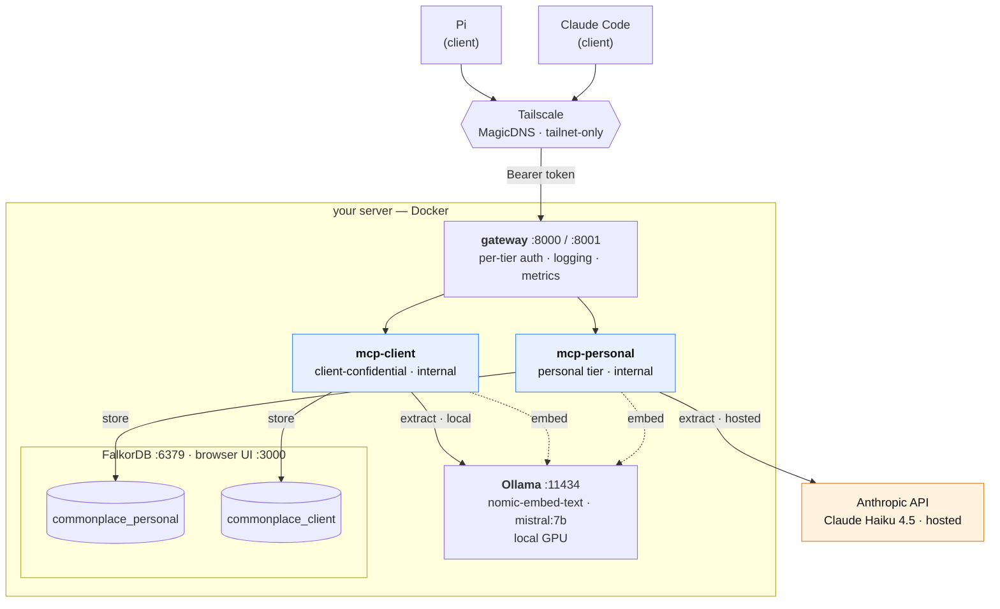

# commonplace

A self-hosted, two-tier [Graphiti](https://github.com/getzep/graphiti) knowledge graph that MCP
clients (for example **Claude Code** and **Pi**) read from and write to over a private
[Tailscale](https://tailscale.com) network. **It's offline-first: by default every part — including
the LLM that extracts your graph — runs on your own hardware, so nothing leaves the box.**

It runs on a single always-on Linux host with Docker and a consumer NVIDIA GPU. Your laptops and
other devices are pure clients — they host nothing.

---

## Why two tiers

Knowledge-graph ingestion uses an LLM to extract entities and relationships from text. That
extraction is where your data would be exposed to a model — so by default `commonplace` does it
**locally**, on your GPU, for both tiers. The two tiers split memory by confidentiality and by
whether you're allowed to trade locality for quality:

| Tier                    | Graph                  | Extraction (default)               | Where it runs  | Use for                                                                  |
| ----------------------- | ---------------------- | ---------------------------------- | -------------- | ------------------------------------------------------------------------ |
| **personal**            | `commonplace_personal` | `mistral:7b-instruct-q4_0` (local) | the host's GPU | your own notes, projects, life — _optionally_ a hosted model for quality |
| **client-confidential** | `commonplace_client`   | `mistral:7b-instruct-q4_0` (local) | the host's GPU | confidential / NDA material that must **never** leave the machine        |

The **personal** tier is local by default but may be pointed at a hosted model (e.g. Claude Haiku)
for higher-quality graphs on **non-confidential** data — opt in via `.env` (see _Hosted upgrade?_
under [Setup](#setup)). The **client** tier is always local; that's the whole point of it.

**Retrieval is cheap and private on both tiers.** Search is embeddings + BM25 + graph traversal
with **no LLM in the query path**. The GPU only ever does slow, asynchronous _background_
extraction — query latency is never affected. Slow local extraction is therefore fine.

Both tiers share **one embedder** (Ollama `nomic-embed-text`, 768-dim) and **one FalkorDB**
holding two separate graphs, so the two memories stay isolated but the infrastructure stays simple.

---

## Architecture



- **One FalkorDB**, two graphs selected per-instance by `FALKORDB_DATABASE`
  (`commonplace_personal` vs `commonplace_client`).
- **Two Graphiti MCP instances** (`commonplace-mcp:local`, built from
  `zepai/knowledge-graph-mcp:standalone` — see `Dockerfile`), HTTP transport, served at path
  **`/mcp/`** (trailing slash).
- **One shared Ollama embedder** (`nomic-embed-text`, 768-dim) used by _both_ instances. Do not
  mix embedders — vectors from different embedders are not comparable.
- **A gateway** (Caddy) fronts both tiers: it owns the host ports, requires a **per-tier bearer
  token** (so a client with only the client token can't reach the personal tier), and emits access
  logs (audit) + Prometheus metrics. The MCP containers themselves are internal-only.

### Endpoint / graph map

> Replace `your-server.your-tailnet.ts.net` with your host's Tailscale MagicDNS name throughout
> (run `tailscale status` on the host to find it).

| Tier        | Host endpoint (tailnet)                            | Internal port | Graph (`FALKORDB_DATABASE`) | LLM                            | `SEMAPHORE_LIMIT` |
| ----------- | -------------------------------------------------- | ------------- | --------------------------- | ------------------------------ | ----------------- |
| personal    | `http://your-server.your-tailnet.ts.net:8000/mcp/` | 8000          | `commonplace_personal`      | `mistral:7b…` (local, default) | 1                 |
| client      | `http://your-server.your-tailnet.ts.net:8001/mcp/` | 8000          | `commonplace_client`        | `mistral:7b-instruct-q4_0`     | 1                 |
| FalkorDB    | `127.0.0.1:6379` (host-local only)                 | 6379          | both graphs                 | —                              | —                 |
| FalkorDB UI | `http://your-server.your-tailnet.ts.net:3000`      | 3000          | browse either graph         | —                              | —                 |
| Metrics     | `127.0.0.1:9180/metrics` (host-local only)         | 9180          | gateway (Prometheus)        | —                              | —                 |

The personal/client endpoints require `Authorization: Bearer <tier-token>` (set `PERSONAL_TOKEN` /
`CLIENT_TOKEN` in `.env`). A request without the right token gets `401`.

---

## Requirements

On the **host**:

- **Docker** with Compose v2.
- **[Ollama](https://ollama.com)** running on the host, serving the shared embedder and the local
  extraction model. The MCP containers reach it over HTTP — the GPU is used by Ollama, not by the
  containers, so no GPU passthrough into Docker is required. A consumer NVIDIA GPU with ~8 GB VRAM
  runs `mistral:7b-instruct-q4_0` comfortably; CPU-only works but local extraction is slow.
- **[Tailscale](https://tailscale.com)** — the MCP endpoints are served over the tailnet, not the
  public internet.
- **No API keys required.** Both tiers extract locally by default. An **Anthropic API key** is needed
  _only_ if you opt the personal tier into a hosted model (see _Hosted upgrade?_ below).

On each **client** (laptop, etc.): Tailscale, plus an MCP-capable client (Claude Code, Pi, …).

---

## Setup

Run on the host, from a clone of this repo (e.g. `~/commonplace`):

```bash
# 1. Pull the models Ollama will serve
ollama pull nomic-embed-text
ollama pull mistral:7b-instruct-q4_0

# 2. Configure secrets
cp .env.example .env
#    edit .env and set:
#      FALKORDB_PASSWORD          (openssl rand -hex 24)
#      PERSONAL_TOKEN / CLIENT_TOKEN   gateway bearer tokens (openssl rand -hex 32 each)
#    (no ANTHROPIC_API_KEY needed — extraction is local by default)

# 3. Build the local image and start the stack
docker compose up -d
docker compose ps        # all services should report healthy
```

Then point a client at the two endpoints — see [Client configuration](#client-configuration).

> **Hosted upgrade?** Everything is local by default. To point the **personal** tier at a hosted
> model for higher-quality graphs (non-confidential data only), set in `.env`:
> `PERSONAL_LLM_PROVIDER=anthropic`, `PERSONAL_LLM_MODEL=claude-haiku-4-5`,
> `PERSONAL_SEMAPHORE_LIMIT=5`, and `ANTHROPIC_API_KEY=…`. The client tier stays local regardless.

> **Upgrading from a pre-gateway deploy?** Add `PERSONAL_TOKEN` / `CLIENT_TOKEN` to `.env`, then
> `docker compose up -d --build --force-recreate` (the MCP tiers move behind the gateway and the
> ontology change needs a recreate). Re-add each client with its `Authorization: Bearer` header —
> existing token-less clients will start getting `401`.

---

## Gotchas (learned the hard way — read before you copy this)

These are the landmines specific to the current (2026) Graphiti MCP server. Several contradict
older docs.

1. **There is no `openai_generic` provider string.** To use Ollama you set `provider: "openai"`
   and point `api_url` at a non-OpenAI URL; the server then auto-selects its `OpenAIGenericClient`
   internally. That generic client is what avoids OpenAI's beta `responses.parse()` (which Ollama
   does not implement). Setting `provider: "openai_generic"` is invalid.
2. **There is no `small_model` setting.** The MCP server has a single `llm.model`. On the openai
   path it uses that same model for the "small" slot too. The infamous `gpt-4.1-mini` is only a
   fallback used when `model` is `None` — pinning `llm.model` is enough to never hit it.
3. **`json_schema` structured output is always on for the local path and cannot be disabled**, and
   **`instructor` is not used there** — retries are built-in (tenacity, 4 attempts). There is no
   config knob for either. If a small local model produces invalid JSON, the only lever is a more
   capable model.
4. **Ollama must be reachable from inside the containers.** Ollama runs on the _host_, so each MCP
   service needs `extra_hosts: ["host.docker.internal:host-gateway"]` and an `api_url` of
   `http://host.docker.internal:11434/v1`. Ollama must listen on `0.0.0.0:11434` (it does by default).
5. **`FALKORDB_DATABASE` selects the graph; `group_id` does not.** Two graphs in one FalkorDB =
   two instances with the same `FALKORDB_URI` and different `FALKORDB_DATABASE`. `group_id` only
   namespaces nodes _within_ a graph.
6. **FalkorDB host/port are parsed from `FALKORDB_URI`** — `FALKORDB_HOST`/`FALKORDB_PORT` are
   ignored. The only env overrides read are `FALKORDB_URI` and `FALKORDB_PASSWORD`.
7. **FalkorDB password is set via `REDIS_ARGS=--requirepass …`**, an env var — _not_ by overriding
   the container `command` (that would stop the FalkorDB module from loading).
8. **Use the `:standalone` image, not `:latest`.** `zepai/knowledge-graph-mcp:latest` bundles its
   own FalkorDB; `:standalone` expects an external one — required to share a single FalkorDB across
   two instances.
9. **The MCP path has a trailing slash: `/mcp/`** (FastMCP default; not configurable).
10. **Anthropic model id: use the bare alias `claude-haiku-4-5`, not `claude-haiku-4-5-latest`.**
    The `-latest` suffix is an OpenAI-ism; the Anthropic API 404s on it (`not_found_error: model`).
    The bare alias resolves to the current dated snapshot (`claude-haiku-4-5-20251001`).
11. **The Anthropic provider needs an explicit numeric `llm.temperature`.** graphiti passes
    `temperature=config.temperature`; with none set it sends `null` and the API 400s
    (`temperature: Input should be a valid number`), so every personal-tier episode queues but
    never processes. The OpenAI/Ollama generic client tolerates `null`, so this bites only the
    Anthropic tier. Set e.g. `temperature: 0.0`.
12. **The `:standalone` image ships WITHOUT the `anthropic` SDK.** `provider: anthropic` then fails
    at startup — "Anthropic client not available in current graphiti-core version" (the factory's
    `HAS_ANTHROPIC` is False because `import anthropic` raises). The bundled `Dockerfile` adds it
    (`uv pip install anthropic`).
13. **graphiti-core builds a default OpenAI reranker at init** that demands `OPENAI_API_KEY` even
    though the search path uses `NODE_HYBRID_SEARCH_RRF` (no cross-encoder). Give each tier a dummy
    `OPENAI_API_KEY` so it can construct; point `OPENAI_BASE_URL` at Ollama so even an accidental
    call stays on-box. In practice it is never called.
14. **FastMCP rejects non-localhost Host headers with HTTP 421 "Invalid Host header".** It
    auto-enables DNS-rebinding protection with a localhost-only allow-list at construction and passes
    that object explicitly into its pydantic Settings, so the `FASTMCP_…` env vars cannot override it
    (init kwargs beat env). The bundled `patch_transport_security.py` (run in the Dockerfile) disables
    the protection — safe on a tailnet, where the network is the trust boundary and clients are agents,
    not browsers. To tighten, set explicit `allowed_hosts` instead.
15. **The container env var for the OpenAI-compatible base URL is `OPENAI_API_URL`** (graphiti's
    config expansion), not `OPENAI_BASE_URL`. Note the reranker (#13) is the opposite — it reads the
    OpenAI SDK's `OPENAI_BASE_URL`. Two different names for two different clients.

---

## Operate

Run on the host, from the repo directory (e.g. `~/commonplace`).

**Redeploy in one command** — `scripts/commonplace` wraps the pull → rebuild → recreate flow
(symlink it onto your `PATH`, e.g. `ln -sf "$PWD/scripts/commonplace" ~/.local/bin/commonplace`):

```bash
commonplace update           # sync repo, rebuild image, recreate config-sensitive services
commonplace update --reset   # same, but hard-reset to origin/main (after a force-push)
commonplace rotate tokens    # regenerate a secret in .env + recreate the services that use it
commonplace status           # service health + graph counts
```

**Rotating secrets** — `commonplace rotate <target>` regenerates a self-generated secret in `.env`
and recreates only the services that use it (it backs up `.env` to a gitignored `.env.bak.<stamp>`
first):

```bash
commonplace rotate falkordb        # FALKORDB_PASSWORD → recreates falkordb + both mcp instances
commonplace rotate personal-token  # PERSONAL_TOKEN    → recreates gateway (update your clients!)
commonplace rotate client-token    # CLIENT_TOKEN      → recreates gateway (update your clients!)
commonplace rotate tokens          # both bearer tokens
commonplace rotate all             # FALKORDB_PASSWORD + both tokens
```

Rotating a bearer token invalidates the old one, so **every client must be updated** with the new
value or it will get `401`. `ANTHROPIC_API_KEY` is issued by Anthropic, not generated here — rotate
it by hand: paste the new key into `.env`, then `docker compose up -d --force-recreate mcp-personal`.

The underlying compose commands, if you'd rather run them by hand:

```bash
# Bring the stack up (after .env is filled in)
docker compose up -d

# Status / health
docker compose ps
docker compose logs -f mcp-personal     # or mcp-client, falkordb

# Restart one instance after a config change (config/*.yaml does not hot-reload)
docker compose up -d --force-recreate mcp-client

# Rebuild the local image after editing the Dockerfile or patch_transport_security.py
docker compose up -d --build

# Stop / start (data persists in the falkordb_data volume)
docker compose stop
docker compose start

# Tear down (KEEP data)
docker compose down
# Tear down AND delete the graphs
docker compose down -v
```

Quick MCP health check (from a client, over the tailnet or LAN). Without a token you get `401`
(auth working); with the right tier token you get `307`:

```bash
curl -s -o /dev/null -w "%{http_code}\n" -H "Authorization: Bearer $PERSONAL_TOKEN" \
  http://your-server.your-tailnet.ts.net:8000/mcp/
curl -s -o /dev/null -w "%{http_code}\n" -H "Authorization: Bearer $CLIENT_TOKEN" \
  http://your-server.your-tailnet.ts.net:8001/mcp/

# Is anyone actually using it? (run on the host)
./scripts/graph_stats.sh        # writes landing per tier
./scripts/mcp_activity.sh       # reads/writes per tier from the gateway log
```

---

## Backup & restore

FalkorDB persists to the `falkordb_data` volume — mounted at its actual data dir
(`/var/lib/falkordb/data`), with **AOF enabled** (`--appendonly yes`), so writes are durable to ~1s
and survive container recreates. Back up / restore the whole data dir (RDB + AOF) with the scripts:

```bash
./scripts/backup.sh                                       # -> ./backups/falkordb-<stamp>.tar.gz
./scripts/restore.sh ./backups/falkordb-<stamp>.tar.gz    # overwrites live data (prompts to confirm)
```

Both read `FALKORDB_PASSWORD` from `.env`. `backup.sh` asks the server for its data dir, so it keeps
working even if the path changes.

> Earlier revisions mounted the volume at `/data` while FalkorDB wrote to `/var/lib/falkordb/data`
> on the ephemeral container layer — so data was lost on every `--force-recreate`. The mount path is
> now fixed; redeploy with `commonplace update` to apply it.

---

## Networking / exposure

- **Default: MagicDNS + port.** The gateway binds `:8000`/`:8001` on the host and is reached over
  the tailnet at `http://your-server.your-tailnet.ts.net:8000/mcp/` and `:8001/mcp/`. This is
  tailnet-reachable (and LAN-reachable) but **not** public — do not port-forward these on your router.
- **Auth.** Every request needs `Authorization: Bearer <tier-token>`; the gateway 401s otherwise.
  Separate `PERSONAL_TOKEN` / `CLIENT_TOKEN` give each client only the tiers it should touch.
- **FalkorDB `:6379` and metrics `:9180` bind to `127.0.0.1` only** (host-local) — never on the tailnet.
- **Keep the host single-homed.** The host's primary interface should hold exactly one IPv4. If a
  second address appears (e.g. a static IP _plus_ a DHCP lease), Tailscale can advertise two
  WireGuard endpoints and the tunnel flaps, which **black-holes TCP over MagicDNS while the LAN and
  `tailscale ping` still appear to work** (disco pings roam across endpoints; real TCP does not).
  On Ubuntu this most often comes from cloud-init re-enabling DHCP — disable its network management
  (`echo 'network: {config: disabled}' | sudo tee /etc/cloud/cloud.cfg.d/99-disable-network-config.cfg`).
  Symptom to watch for: `ip -brief addr show <iface>` listing more than one address on your LAN subnet.
- **HTTPS upgrade (optional).** To serve the MCP endpoints as tailnet-only HTTPS names instead of
  raw ports:
  ```bash
  tailscale serve --bg --https=8443 http://localhost:8000   # personal
  tailscale serve --bg --https=8444 http://localhost:8001   # client
  ```
  then point clients at `https://your-server.your-tailnet.ts.net:8443/mcp/` etc. MagicDNS:port is
  the simpler default and is what the client config below uses.

---

## Client configuration

> Replace `your-server.your-tailnet.ts.net` with your host's Tailscale MagicDNS name (`tailscale
status`). The identical ports/paths are also served on the host's LAN IP, which is a handy
> fallback if MagicDNS is ever unreachable.

### Claude Code (user scope)

Pass the per-tier bearer token with `--header`. Give a client only the tiers it should reach (e.g.
omit the personal server on a machine that handles confidential work):

```bash
claude mcp add --scope user --transport http commonplace-personal http://your-server.your-tailnet.ts.net:8000/mcp/ \
  --header "Authorization: Bearer $PERSONAL_TOKEN"
claude mcp add --scope user --transport http commonplace-client   http://your-server.your-tailnet.ts.net:8001/mcp/ \
  --header "Authorization: Bearer $CLIENT_TOKEN"
claude mcp list   # both should report ✓ Connected
```

(New servers load on the next Claude Code start.)

### Pi (extension + `~/.pi/agent/mcp.json`)

Pi has no native MCP — add the community bridge, then a global `mcp.json`:

```bash
pi install npm:@spences10/pi-mcp     # records the bridge in settings.json
```

Each server entry must include `"type": "http"`; a `url`-only entry triggers an OAuth handshake
this server doesn't support. The extension lazy-connects by default — set
`MY_PI_MCP_EAGER_CONNECT=1` to connect and discover tools at startup.

```json
{
  "mcpServers": {
    "commonplace-personal": {
      "type": "http",
      "url": "http://your-server.your-tailnet.ts.net:8000/mcp/",
      "headers": { "Authorization": "Bearer YOUR_PERSONAL_TOKEN" }
    },
    "commonplace-client": {
      "type": "http",
      "url": "http://your-server.your-tailnet.ts.net:8001/mcp/",
      "headers": { "Authorization": "Bearer YOUR_CLIENT_TOKEN" }
    }
  }
}
```

---

## Adding another client

Any device on the tailnet can use the same two endpoints — there is nothing per-client on the
server. To add one:

1. Join the device to the tailnet (`tailscale up`) and confirm it can reach the host
   (`tailscale ping your-server`).
2. For Claude Code, run the two `claude mcp add … /mcp/` commands above (user scope).
3. For any MCP client, add both servers with `"type": "http"` pointing at
   `:8000/mcp/` and `:8001/mcp/`.
4. Nothing to change on the host — graphs and auth are shared; reads/writes from the new client
   land in the same two graphs.
5. For HTTPS, expose via `tailscale serve` (above) and use the `https://…` URLs instead.

---

## Memory & ontology

Two things turn this from a memory _store_ into a memory _system agents use well_:

- **Per-tier ontology.** Each tier defines `graphiti.entity_types` in its config (personal:
  Preference, Project, Person, Decision, …; client: Engagement, Stakeholder, Requirement, Risk, …).
  These type descriptions constrain extraction — the single biggest lever on graph quality, and they
  help the weak local model the most. An entity can also declare optional typed `fields:` (e.g.
  `Decision.rationale`, `Deliverable.due_date`) to capture structured attributes; fields are always
  optional, so a value the extractor can't find is simply left empty.
- **An agent protocol.** [`docs/memory-protocol.md`](docs/memory-protocol.md) is the contract for any
  client (Claude Code, Pi): search before answering, write durable facts, **never cross tiers** (no
  confidential data on the hosted personal tier), and cite what you used. Install it as a skill or
  system prompt — without it, agents rarely call memory and the graph stays empty.

**Is it actually being used?** `scripts/graph_stats.sh` shows whether _writes_ are landing;
`scripts/mcp_activity.sh` (and the Prometheus endpoint on `:9180`) show whether agents are _reading_.
Seed an existing corpus with `scripts/ingest_markdown.py`, pull token-budgeted context with
`scripts/recall.py`, gate retrieval quality with `eval/run_eval.py`, and review resolved
contradictions with `scripts/contradictions.sh`. Over time, reclaim old raw episodes (keeping the
facts derived from them) with `scripts/compact_episodes.sh` — report-only until `--apply`. See the
[open issues](https://github.com/itsmeduncan/commonplace/issues) for what's still open (a local
reranker remains the notable deferral).

---

## Repo layout

```
commonplace/
├── docker-compose.yml           # FalkorDB + 2 MCP instances + gateway, restart: unless-stopped
├── Dockerfile                   # commonplace-mcp:local — standalone image (digest-pinned) + patch
├── patch_transport_security.py  # build-time: allow remote Host headers (disable DNS-rebind guard)
├── gateway/
│   └── Caddyfile                # per-tier bearer auth + access logging + Prometheus metrics
├── config/
│   ├── personal.yaml            # instance A — Anthropic Haiku extraction + personal ontology
│   └── client.yaml              # instance B — local Ollama extraction + confidential ontology
├── scripts/
│   ├── commonplace              # operate CLI: `commonplace update` redeploys the stack
│   ├── graph_stats.sh           # write counts per tier   · mcp_activity.sh  # read counts (gateway log)
│   ├── recall.py                # token-budgeted recall    · contradictions.sh # superseded facts
│   ├── compact_episodes.sh      # prune old raw episodes, keep facts (report-only until --apply)
│   ├── backup.sh / restore.sh   # FalkorDB dump + restore
│   └── ingest_markdown.py       # load a markdown corpus (notes/docs) into a tier
├── eval/
│   ├── queries.yaml             # retrieval eval cases (question → expected facts)
│   ├── run_eval.py              # scores recall against a tier
│   └── rerank_bench.py          # RRF-vs-reranker benchmark (MRR/recall@k/nDCG@k) — reranker gate
├── docs/
│   └── memory-protocol.md       # how agents should read/write memory (tier safety, cite-back)
├── .env.example                 # template; copy to .env on the host (gitignored)
├── .dockerignore                # keeps .env and other secrets out of the build context
├── CLAUDE.md                    # guidance for Claude Code working in this repo
├── LICENSE                      # MIT
└── README.md
```

Secrets live only in `.env` on the host and are never committed. The repo is the source of
truth: edit a clone, push to your fork, `git pull` on the host, `docker compose up -d`.

---

## License

[MIT](LICENSE).
